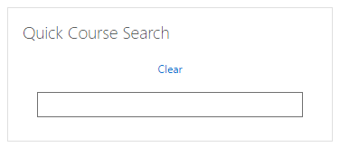
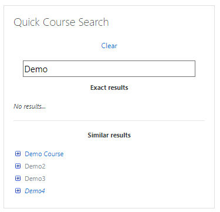
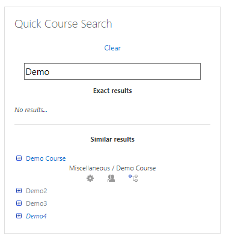
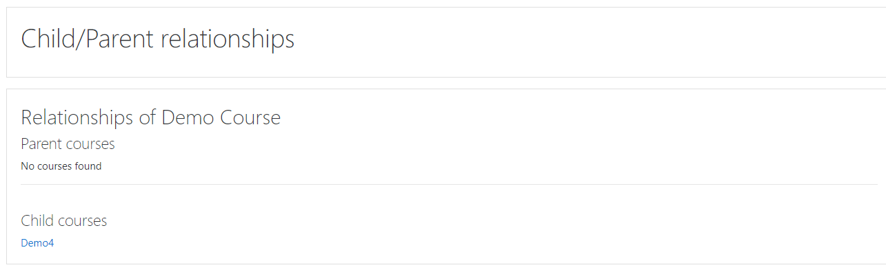
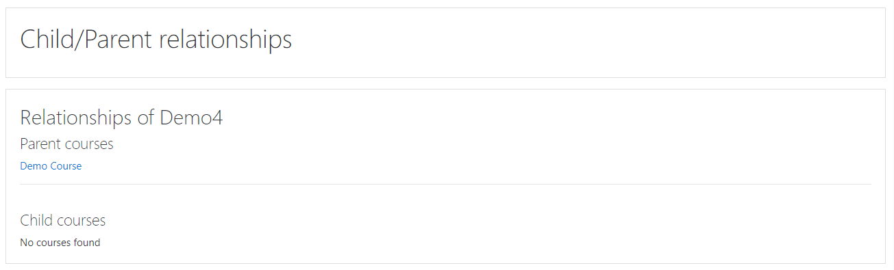

Quick Course Search
==========

The quick_course block allows you to search quickly for courses, without having to go through the Moodle course interface.

* As site admin or user with block/quick_course:searchall capability - Search all courses in the site
* As a user with block/quick_course:search capability - Search all courses you are enrolled to, including any courses in categories you are category enrolled to.

Requirements
------------
Moodle 3.4+

Screenshots
-----------
These screenshots were taken on a plain Moodle installation with no fancy theme installed. Appearances may vary slightly depending on your theme.

The Block:

The block with some search results:

Search results expanded to see extra links:

The course relationships page, showing a parent (meta) course and its child relationships:

The course relationships page, showing a child course and its parent (meta) relationships:

Installation
------------
**From github:**
1. Download the latest version of the plugin from the [Releases](https://github.com/cwarwicker/moodle-block_quick_course/releases) page.
2. Extract the directory from the zip file and rename it to 'quick_course' if it is not already named as such.
3. Place the 'quick_course' folder into your Moodle site's */blocks/* directory.
4. Run the Moodle upgrade process either through the web interface or command line.
5. Add the block to a page and start using it

License
-------
https://www.gnu.org/licenses/gpl-3.0

Support
-------
If you need any help using the block, or wish to report a bug or feature request, please use the issue tracking system: https://github.com/cwarwicker/moodle-block_quick_course/issues